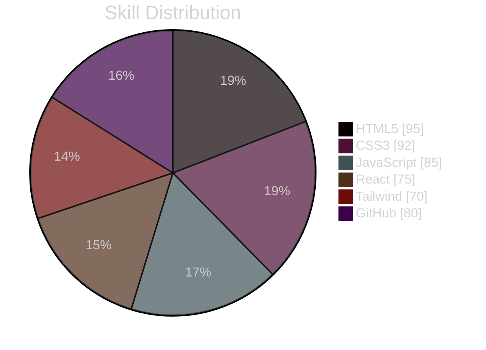

<svg width="680" height="360" viewBox="0 0 680 360" xmlns="http://www.w3.org/2000/svg">
<defs>
<linearGradient id="curve-grad" x1="0" y1="0" x2="1" y2="0">
<stop offset="0%" stop-color="#6b6b6b" stop-opacity="0"/>
<stop offset="100%" stop-color="#e8e8e8" stop-opacity="0.9"/>
</linearGradient>
</defs>

<rect x="0" y="0" width="680" height="360" rx="20" fill="#141414"/>
<rect x="0.5" y="0.5" width="679" height="359" rx="19.5" fill="none" stroke="#2a2a2a" stroke-width="1"/>

<rect x="40" y="36" width="200" height="30" rx="15" fill="#1f1f1f" stroke="#333333" stroke-width="0.5"/>
<circle cx="58" cy="51" r="5" fill="#f0f0f0">
  <animate attributeName="opacity" values="1;0.3;1" dur="2s" repeatCount="indefinite"/>
</circle>
<text x="74" y="51" font-size="11" letter-spacing="0.5" fill="#cfcfcf" font-family="Helvetica, Arial, sans-serif" dominant-baseline="central">AVAILABLE FOR PROJECTS</text>

<path id="curve" d="M 130 250 C 280 210, 340 130, 430 150 C 500 165, 540 110, 600 70" fill="none" stroke="url(#curve-grad)" stroke-width="1.5"/>

<circle cx="600" cy="100" r="40" fill="none" stroke="#2bb3a3" stroke-width="1" opacity="0.55"/>
<circle r="6" fill="#f5f5f5">
  <animateMotion dur="6s" repeatCount="indefinite" path="M 130 250 C 280 210, 340 130, 430 150 C 500 165, 540 110, 600 70"/>
</circle>

<text x="40" y="118" font-size="12" letter-spacing="1" fill="#8a8a8a" font-family="Helvetica, Arial, sans-serif">// FRONTEND DEVELOPER &#183; WEB DESIGNER</text>

<text x="38" y="178" font-size="44" font-weight="500" fill="#fafafa" font-family="Helvetica, Arial, sans-serif">Shamshiddinov</text>
<text x="38" y="232" font-size="44" font-weight="500" fill="#fafafa" font-family="Helvetica, Arial, sans-serif">Fazliddin</text>

<text x="40" y="266" font-size="14" fill="#b7b7b7" font-family="Helvetica, Arial, sans-serif">React, JavaScript, HTML5, CSS3 and clean dark interfaces.</text>
<text x="40" y="288" font-size="12" fill="#7a7a7a" font-family="Helvetica, Arial, sans-serif">Toshkent, O'zbekiston &#183; Frontend Developer</text>

<rect x="40" y="308" width="150" height="34" rx="8" fill="#f5f5f5"/>
<text x="115" y="325" font-size="13" font-weight="500" fill="#161616" text-anchor="middle" font-family="Helvetica, Arial, sans-serif" dominant-baseline="central">VIEW PORTFOLIO</text>

<rect x="200" y="308" width="100" height="34" rx="8" fill="#1f1f1f" stroke="#333333" stroke-width="0.5"/>
<text x="250" y="325" font-size="13" fill="#dcdcdc" text-anchor="middle" font-family="Helvetica, Arial, sans-serif" dominant-baseline="central">GitHub</text>

<rect x="310" y="308" width="110" height="34" rx="8" fill="#1f1f1f" stroke="#333333" stroke-width="0.5"/>
<text x="365" y="325" font-size="13" fill="#dcdcdc" text-anchor="middle" font-family="Helvetica, Arial, sans-serif" dominant-baseline="central">Telegram</text>
</svg>
<div align="center">


<br><br>

<sub>// FRONTEND DEVELOPER · WEB DESIGNER</sub>

# Shamshiddinov Fazliddin

**React, Tailwind CSS, JavaScript and clean dark interfaces.**

<sub>Toshkent, O'zbekiston · Frontend Developer · Web Designer</sub>

<br>

[](#)
[](https://github.com/fazliddin-coder1)
[](#)
[](#)

</div>

---

## 01 / About me

I am **Shamshiddinov Fazliddin**, a **Frontend Developer** and **Web Designer** living in Tashkent. My portfolio style is based on black backgrounds, thin neon lines, minimalist layouts, and smooth animations.

I work on practical projects with **React, JavaScript, HTML5, CSS3**, and modern tooling. My goal: to create beautiful, fast, responsive, and user-friendly web interfaces.

```
Name        Shamshiddinov Fazliddin
Role        Frontend Developer / Web Designer
Location    Toshkent, O'zbekiston
Portfolio   coming soon
GitHub      fazliddin-coder1
Telegram    @your_telegram
Email       your.email@gmail.com
```

---

## 02 / Portfolio stack

<p align="left">
  
  
  
  
  
  
  
  
  
</p>

| Skill | Level | Portfolio signal |
|---|---|---|
| HTML5 | 95% | Semantic structure and clean markup |
| CSS3 | 92% | Responsive layouts and visual polish |
| VS Code | 90% | Daily development workflow |
| JavaScript | 85% | DOM, logic and interactivity |
| GitHub | 80% | Repository and project publishing |
| React / JSX | 75% | Component-based interfaces |
| Tailwind CSS | 70% | Fast modern UI building |
| Figma | 65% | UI planning, spacing and visual design |

---

## 03 / Visual radar

<div align="center">



</div>

---

## 04 / Projects

| Project | Stack | Link |
|---|---|---|
| Portfolio Website | HTML, CSS, JavaScript, React | [Open](#) |
| Wezr App (Weather App) | HTML, CSS, JavaScript, React | [Open](https://github.com/fazliddin-coder1/wezr-app) |

---

## 05 / GitHub activity

<div align="center">

[](https://github.com/fazliddin-coder1)

[](https://github.com/fazliddin-coder1)

[](https://github.com/fazliddin-coder1)

</div>

---

<div align="center">

⭐ **Loyihalarim yoqsa, star bosishni unutmang!**

</div>
