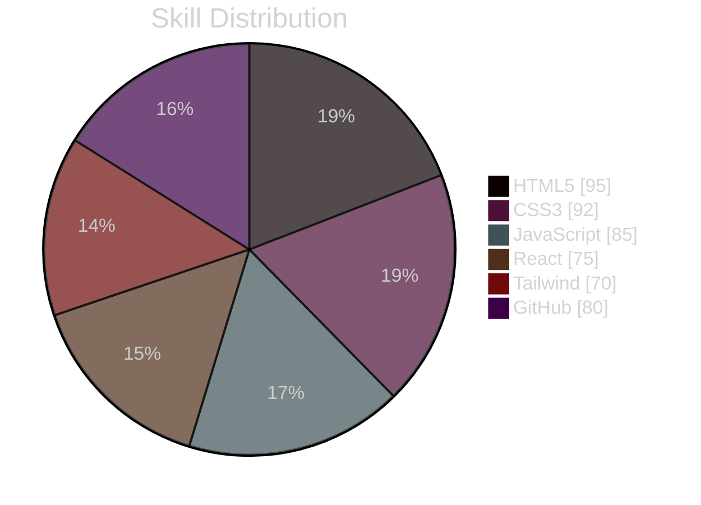

<div align="center">


<br><br>

<sub>// FRONTEND DEVELOPER · WEB DESIGNER</sub>

# Shamshiddinov Fazliddin

**React, Tailwind CSS, JavaScript and clean dark interfaces.**

<sub>Toshkent, O'zbekiston · Frontend Developer · Web Designer</sub>

<br>

[](#)
[](https://github.com/fazliddin-coder1)
[](#)
[](#)

</div>

---

## 01 / About me

I am **Shamshiddinov Fazliddin**, a **Frontend Developer** and **Web Designer** living in Tashkent. My portfolio style is based on black backgrounds, thin neon lines, minimalist layouts, and smooth animations.

I work on practical projects with **React, JavaScript, HTML5, CSS3**, and modern tooling. My goal: to create beautiful, fast, responsive, and user-friendly web interfaces.

```
Name        Shamshiddinov Fazliddin
Role        Frontend Developer / Web Designer
Location    Toshkent, O'zbekiston
Portfolio   coming soon
GitHub      fazliddin-coder1
Telegram    @your_telegram
Email       your.email@gmail.com
```

---

## 02 / Portfolio stack

<p align="left">
  
  
  
  
  
  
  
  
  
</p>

| Skill | Level | Portfolio signal |
|---|---|---|
| HTML5 | 95% | Semantic structure and clean markup |
| CSS3 | 92% | Responsive layouts and visual polish |
| VS Code | 90% | Daily development workflow |
| JavaScript | 85% | DOM, logic and interactivity |
| GitHub | 80% | Repository and project publishing |
| React / JSX | 75% | Component-based interfaces |
| Tailwind CSS | 70% | Fast modern UI building |
| Figma | 65% | UI planning, spacing and visual design |

---

## 03 / Visual radar

<div align="center">



</div>

---

## 04 / Projects

| Project | Stack | Link |
|---|---|---|
| Portfolio Website | HTML, CSS, JavaScript, React | [Open](#) |
| Wezr App (Weather App) | HTML, CSS, JavaScript, React | [Open](https://github.com/fazliddin-coder1/wezr-app) |

---

## 05 / GitHub activity

<div align="center">

[](https://github.com/fazliddin-coder1)

[](https://github.com/fazliddin-coder1)

[](https://github.com/fazliddin-coder1)

</div>

---

<div align="center">

⭐ **Loyihalarim yoqsa, star bosishni unutmang!**

</div>
